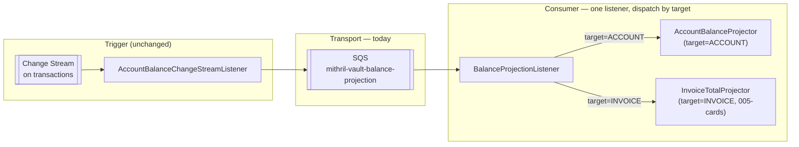
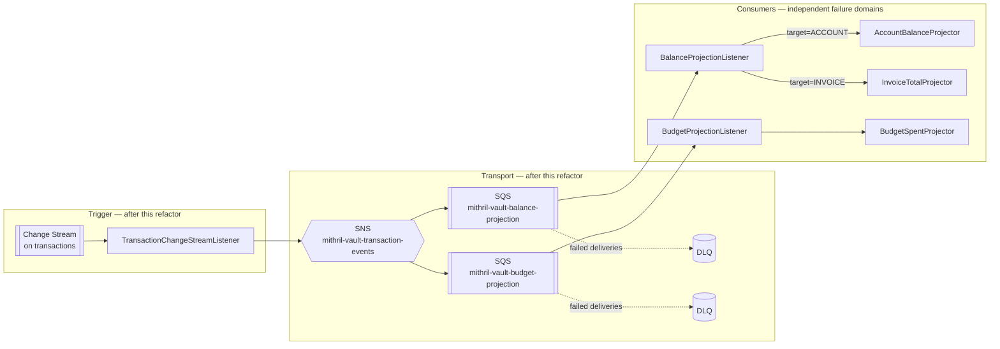

# ADR-004: Defer per-projector fan-out (SNS + dedicated queues) until an orthogonal projection consumer exists

> **Document metadata**
> - **ID:** ADR-004
> - **Status:** Accepted
> - **Author:** Architect
> - **Date:** 2026-08-01
> - **Linked PRD:** `docs/prd/PRD-CROSS-01-materialized-balance-projections.md` (account-balance half);
>   no PRD yet for `specs/008-budgets` — this decision's trigger condition is written against that
>   future feature by name, not by requirement ID
> - **Linked Spec:** `docs/technical-solutions/materialized-projections.md` (this ADR refines its
>   §2.1 transport choice, does not replace it)
> - **Related ADRs:** `docs/adr/ADR-002-invoice-generation-via-sqs.md` (established the SQS/DLQ
>   shape this ADR keeps using), `docs/adr/ADR-003-materialized-derived-balances.md` (established
>   the single-queue, `target`-dispatch shape this ADR evaluates and — for now — keeps)

---

## Context

While implementing and testing `AccountBalanceProjector` (§11.6 of
`specs/003-accounts/implementation-notes.md`), a question came up about how this design is meant
to scale once more projection types exist. ADR-003 already anticipates this directly: *"Future
derived values (budget `spentAmount`, dashboard 'Saldo Líquido Disponível') reuse the same shape
rather than re-deciding this."* Reasoning through what "reusing the same shape" actually means in
practice surfaced a real distinction ADR-003 didn't spell out, and this ADR records it before it's
forgotten.

**The account/invoice split does not need fan-out, because it's mutually exclusive.**
`specs/004-transactions/data-model.md` states the constraint plainly: `accountId != null XOR
invoiceId != null`. `TransactionDocument.projectionTarget()` picks exactly one of `ACCOUNT` /
`INVOICE` per transaction. `BalanceProjectionListener`'s single `@SqsListener`, bound to one queue,
branches on `target` and only ever runs *one* of the two projector paths per message — there is no
scenario where both need to fire for the same transaction.
`docs/technical-solutions/materialized-projections.md` §3.1 already states the reason one queue is
safe here: *"SQS queues are competing-consumer, not pub/sub, so two independent `@SqsListener`
methods both bound to this queue would race for every message rather than each reliably seeing
only its own target."* Because only one branch of the existing `switch` ever executes, this was
never actually a competing-consumer problem — it's one consumer, one message, one path taken.

**Budget `spentAmount` breaks that assumption.** Per `specs/008-budgets` (see
`docs/implementation-plan.md` Feature 3.2), a budget's `spentAmount` depends on *every* transaction
matching `(ownerId, categoryId, month)` — regardless of whether that transaction is account-sourced
or invoice-sourced. If `spentAmount` is ever migrated from `implementation-plan.md`'s current
on-read aggregation sketch to the materialized-projection pattern ADR-003 already commits to
reusing, a `BudgetSpentProjector` would need to observe **every** transaction event, independent of
`target`. That is no longer "exactly one branch fires" — it's "this message needs to be seen by
two independent consumers." Bolting that onto the existing single-listener shape (calling both
`AccountBalanceProjector`/`InvoiceTotalProjector` *and* `BudgetSpentProjector` sequentially inside
one `@SqsListener` method) would work correctly — idempotency still holds — but it couples their
**failure domains**: a bug in the newer, less-exercised budget path would cause SQS to redeliver
the *entire* message on error, forcing the already-successful account-balance step to be
redundantly reprocessed, delaying its own visibility-timeout/backoff window, and producing a DLQ
entry that doesn't say which of the two steps actually failed.

**Dashboard "Saldo Líquido" does *not* add a third consumer.** `specs/007-dashboard/data-model.md`
is explicit that it's a second-order projection: `saldoLiquido = SUM(account.currentBalance) −
SUM(open invoice.totalAmount)`, read directly off the already-materialized fields, never
subscribing to `transactions` itself. It's worth stating this precisely so a future reader doesn't
assume dashboard needs its own queue/listener the way budget would — it doesn't.

---

## Decision

**For now, we keep exactly what ADR-003 built: one SQS queue (`mithril-vault-balance-projection`),
one `@SqsListener` (`BalanceProjectionListener`), dispatching on `target`.** This remains correct
and sufficient as long as every projection reachable from that queue is mutually exclusive per
transaction — which today (`ACCOUNT` / `INVOICE`) it is.

**We will introduce fan-out — an SNS topic publishing to per-projector SQS queues — at the specific
point a projection is added that is *not* mutually exclusive with the existing ones.** Concretely,
that trigger is: **`BudgetSpentProjector` is built** (whenever `specs/008-budgets`'s `spentAmount`
is migrated from on-read aggregation to a materialized, event-driven projection, per ADR-003's
stated intent). At that point:

- `AccountBalanceChangeStreamListener` (or its eventual generalized rename, e.g.
  `TransactionChangeStreamListener`, if it ends up publishing more than balance-shaped events)
  publishes to a new SNS topic (`mithril-vault-transaction-events`) instead of directly to the
  existing SQS queue.
- The topic fans out to **two** SQS queues, each with its own DLQ and redrive policy:
  - `mithril-vault-balance-projection` (existing, unchanged) — still consumed by
    `BalanceProjectionListener`, still dispatching `ACCOUNT`/`INVOICE` by `target`, since that pair
    is still mutually exclusive and still doesn't need its own fan-out internally.
  - `mithril-vault-budget-projection` (new) — consumed by a new `BudgetProjectionListener` running
    `BudgetSpentProjector`, completely independent retry/backoff/DLQ from the balance queue.
- Dashboard "Saldo Líquido" gets **no new queue** — it stays a read-time composition over
  already-materialized fields, per `specs/007-dashboard/data-model.md`.

This is the same problem the diagram is meant to make legible: a failure inside
`BudgetProjectionListener` now only redelivers on `mithril-vault-budget-projection`, and can never
cause `BalanceProjectionListener` to redo work it already finished. That's the entire point of the
refactor — everything else (idempotency guard, `appliedProjections` marker,
`TransactionalOperator`-wrapped writes) stays exactly as-is per projector; only the transport
topology changes.

---

## Status

`Accepted` — 2026-08-01

---

## Consequences

**Positive (of deferring, now):**

- No new infrastructure (SNS topic, second queue, second DLQ, second `@SqsListener`) for a
  consumer (`BudgetSpentProjector`) that doesn't exist yet — avoiding exactly the kind of
  speculative build-out `docs/architecture-contract.md` P2's "deliberate over-engineering" framing
  does *not* extend to (over-engineering the parts of the system that are actually being exercised
  is the stated goal; over-engineering for a feature not yet started is not).
- Keeps `docs/technical-solutions/materialized-projections.md`'s existing component breakdown and
  sequence diagrams valid as-is — this ADR doesn't invalidate anything already built or tested.
- The migration described above is additive, not a rewrite: existing idempotency logic
  (`appliedProjections`, the `TransactionalOperator`-wrapped mark-applied + `$inc`) is unchanged;
  only the publish target (SNS topic vs. direct-to-SQS) and the new queue/listener pair are new.

**Negative:**

- This is a decision to do more work *later*, under time pressure of an active feature (budgets),
  rather than now. There's a real risk the refactor gets skipped in the moment and the budget
  projector just gets bolted onto the existing listener "to ship faster" — see Risks below.
- Until the refactor happens, if `BudgetSpentProjector` is ever built against the *existing* queue
  (i.e., this ADR's guidance is ignored), the coupled-failure-domain cost described in Context
  becomes real: a budget bug degrades account-balance delivery latency, and DLQ triage becomes
  ambiguous about which projector actually failed.

**Risks and mitigations:**

- *Risk:* this ADR is forgotten by the time `specs/008-budgets` is actually implemented, and the
  budget projector quietly gets added as a third branch in `BalanceProjectionListener`'s dispatch
  instead of triggering the fan-out refactor. *Mitigation:* this ADR's trigger condition is stated
  as a concrete, checkable fact ("`BudgetSpentProjector` is built") rather than a vague future
  intent — `specs/008-budgets`'s eventual implementation-notes should link back here explicitly,
  the same way `specs/003-accounts/implementation-notes.md` §11 links to ADR-003.
- *Risk:* `specs/008-budgets` ships `spentAmount` as the on-read aggregation
  `docs/implementation-plan.md` currently sketches (never migrating to a materialized projection at
  all). *Mitigation:* in that case this ADR's trigger condition never fires and no refactor is
  needed — the decision to defer was still correct, it just turns out to be permanent rather than
  temporary. Worth revisiting this ADR's Status if that's how `008-budgets` actually ships.

---

## Alternatives Considered

### Option A: Build the SNS fan-out now, preemptively (rejected)

Provision the SNS topic and a `mithril-vault-budget-projection` queue today, ahead of any consumer
that reads from it.

**Rejected because:** there is nothing to test against — an unconsumed queue proves nothing and
just adds operational surface (a topic, a queue, a DLQ, seed-script changes) with no corresponding
learning value until a real second consumer exists to exercise the failure-isolation property this
ADR exists to teach. This is the specific flavor of over-engineering the project's stated learning
goal does not ask for: building infrastructure ahead of the feature that would justify it, rather
than building the feature and letting its real requirements drive the design.

### Option B: Keep one shared queue/listener permanently, accept coupled failure domains (rejected as the long-term answer)

Add `BudgetSpentProjector` as a third unconditional call inside `BalanceProjectionListener.handle()`
when the time comes, and rely on idempotency + the (still-unbuilt) reconciliation job to paper over
any redundant reprocessing.

**Rejected as the permanent answer because:** idempotency guarantees *correctness* under redundant
reprocessing, not *absence of cost* — the wasted work, coupled backoff, and ambiguous DLQ triage
described in Context are real operational costs, not correctness bugs, and they only get worse as
more orthogonal projections (this ADR's Context names budget as the first, but nothing rules out a
second later) get bolted onto the same handler. Accepted only as this project's *current*,
temporary state (Decision, above) because no second orthogonal consumer exists yet to pay that cost
against.

### Option C: SQS message filtering (message attributes + subscription filter policies) on one shared queue instead of SNS fan-out (rejected)

Keep a single queue, but have `BudgetProjectionListener` and `BalanceProjectionListener` each
independently poll it, using message-attribute filtering to skip messages not meant for them.

**Rejected because:** this doesn't actually solve the underlying problem — SQS delivers each
message to exactly one consumer in a competing-consumer group regardless of what that consumer does
with it afterward (skip, requeue, process); two listeners polling the same queue would still race
for every message, with roughly half silently never reaching the "right" listener at all. Message
attributes can filter what an *SNS subscription* receives (that's exactly what the fan-out in this
ADR's Decision uses), but they cannot turn one SQS queue into something multiple independent
consumer groups can each fully observe — restating
`docs/technical-solutions/materialized-projections.md` §3.1's point, SNS is the piece that turns
"one event" into "one copy per interested queue," not SQS on its own.

### Option D: Kafka topics + consumer groups instead of SNS + SQS (deferred)

Replace the SQS-based transport entirely with Kafka, where multiple consumer groups natively each
receive a full copy of every message without any fan-out plumbing.

**Deferred because:** would be a stronger, more idiomatic fit for genuine multi-consumer fan-out,
but introduces a second messaging paradigm alongside the AWS-flavored SQS/SNS/LocalStack stack
ADR-002 already established and this codebase already depends on — the same "keep the project's
infra choices consistent" reasoning ADR-002 used to reject RabbitMQ/Kafka for invoice generation
applies here. Worth reconsidering only if a future feature needs something SNS+SQS genuinely can't
provide (ordered multi-consumer replay, partition-scoped ordering guarantees), which no
currently-planned feature does.

---

## References

- `docs/adr/ADR-002-invoice-generation-via-sqs.md` — the SQS/DLQ shape this ADR continues to reuse
  for both the existing and future queues
- `docs/adr/ADR-003-materialized-derived-balances.md` — established the single-queue,
  `target`-dispatch shape this ADR evaluates
- `docs/technical-solutions/materialized-projections.md` §3.1 — "SQS queues are competing-consumer,
  not pub/sub," the property this ADR's whole Context section is built on; also the component
  breakdown this ADR refines, not replaces
- `specs/004-transactions/data-model.md` — the `accountId XOR invoiceId` constraint that makes the
  current single-listener dispatch safe
- `specs/007-dashboard/data-model.md` §"Saldo Líquido Disponível" — confirms dashboard is a
  second-order projection, not a third transaction-event consumer
- `docs/implementation-plan.md` Feature 3.2 (`specs/008-budgets`) — current on-read aggregation
  sketch for `spentAmount`; the trigger condition for this ADR's deferred refactor
