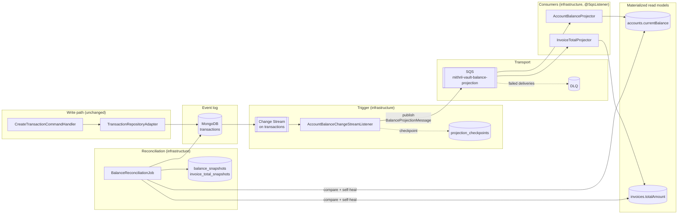
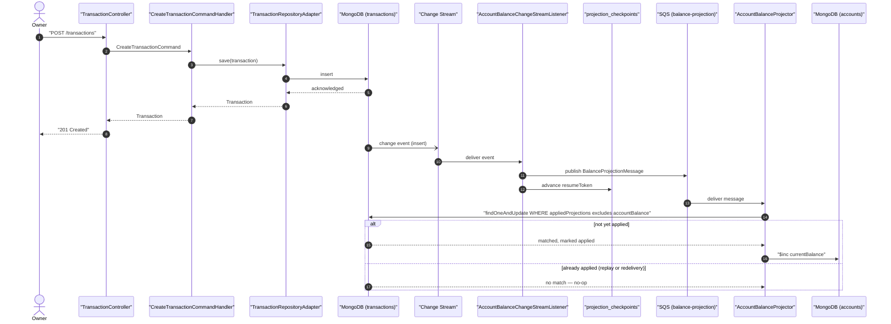
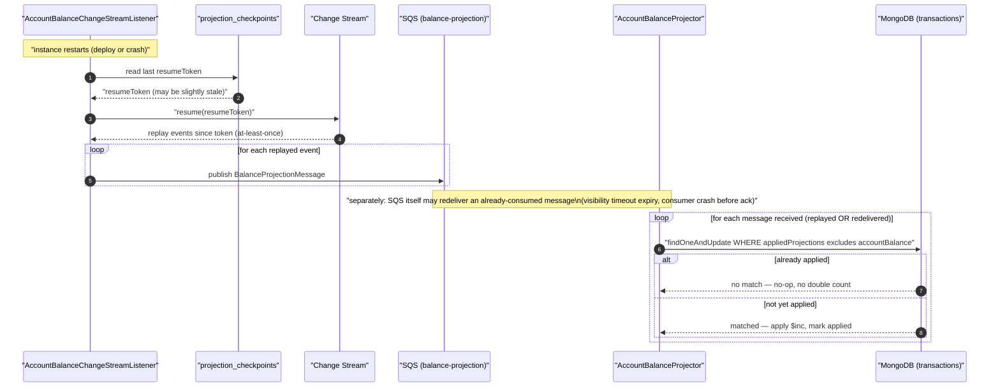
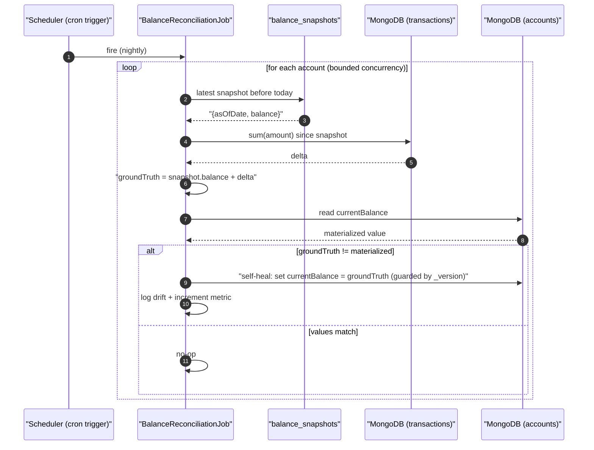
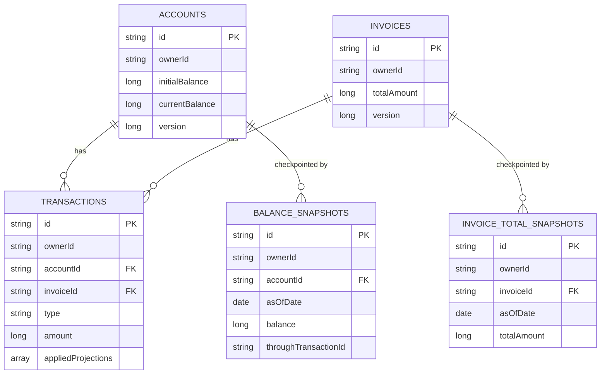

# Technical Specification: Materialized Derived-Value Projections

> **Document metadata**
> - **ID:** SPEC-CROSS-01
> - **Status:** Approved
> - **Author:** Architect
> - **Last updated:** 2026-07-26
> - **Linked ADR:** `docs/adr/ADR-003-materialized-derived-balances.md`
> - **Linked Specs:** `specs/003-accounts/data-model.md`, `specs/005-cards/data-model.md`,
>   `specs/007-dashboard/data-model.md`
> - **Reviewers:** Lucas

---

## 1. Overview

This is a **cross-cutting** technical spec, not a per-feature one — it doesn't belong to a single
`specs/NNN-*` folder because it's a pattern shared by `003-accounts` (retrofit onto an existing,
shipped aggregation) and `005-cards` (built in from day one, since that feature has no
implementation yet). It documents how `accounts.currentBalance` and `invoices.totalAmount` go
from "computed fresh on every read" to "stored fields kept in sync by an event-driven projector,"
per `docs/adr/ADR-003-materialized-derived-balances.md`. That ADR records *why*; this document
records *how it's built*: the components, their sequencing, and the failure modes each one exists
to close.

Deliberately over-scoped as a learning exercise (one real user, multi-user architecture is a
stated goal — `docs/architecture-contract.md` P2) — the same framing `ADR-002` used for
event-driven invoice generation. The two documents share a lesson: **reconciliation, not
delivery guarantees, is what makes an async system trustworthy.** ADR-002 leans on SQS
redelivery + a self-deriving monthly job; this design leans on the same SQS/`@SqsListener`/DLQ
machinery ADR-002 already established, fed by a MongoDB Change Stream that guarantees no write to
`transactions` is ever missed, plus idempotent projection and a self-healing reconciliation job.

**Why a Change Stream *and* SQS, not just one:** the Change Stream is what detects every write to
`transactions` regardless of which code path produced it — nothing can forget to trigger the
projection, because nothing has to remember to call anything; the change stream just observes the
oplog. SQS is what actually delivers that event to the component that applies the `$inc`, reusing
the exact queue/listener/DLQ shape ADR-002 already built for invoice generation instead of running
a second, structurally-identical async mechanism in this codebase. See ADR-003's Decision and
Alternatives (Option A-revised, Option B) for the full reasoning.

**Architecture diagram:**

---

## 2. Architecture

### 2.1 Key Architectural Decisions

- **MongoDB Change Stream as trigger, SQS as transport** — the Change Stream subscribes directly
  to `transactions` so no write is ever missed regardless of which code path produced it; it
  publishes to the same SQS/`@SqsListener`/DLQ shape ADR-002 already established for invoice
  generation, rather than applying the `$inc` inline (Option A-revised, rejected) or introducing a
  hand-rolled outbox collection (Option B, superseded — see ADR-003 Alternatives for both).
- **Idempotent, at-least-once projection** — both the Change Stream (on listener restart) and SQS
  (on redelivery) can redeliver; every applied event marks itself on the source transaction
  (`appliedProjections`) so a replay from either leg is a no-op, not a double-count.
- **Order-independence is load-bearing, not incidental** — SQS standard queues don't guarantee
  order. This design is safe only because `$inc` is commutative; a future projection with
  order-sensitive semantics would need a different transport (see ADR-003's "Out-of-order
  delivery" failure mode).
- **Reconciliation as the resilience mechanism** — same shape as ADR-002's monthly rollover job:
  a scheduled process re-derives ground truth independently and self-heals drift, rather than the
  system trusting that projection delivery was perfect.
- **Snapshots bound recomputation, not just storage** — `balance_snapshots` /
  `invoice_total_snapshots` exist so reconciliation and any future "balance as of date" query
  never re-scan full transaction history, only "since the last checkpoint."
- **One owner per materialized field** — only the `@SqsListener` projector, the reconciliation
  job, and (for accounts only) the reconcile-account direct-adjustment path may write
  `currentBalance` / `totalAmount`. No other application code touches these fields (ADR-003,
  restated from P4).

### 2.2 Design Patterns Used

| Pattern | Applied where | Rationale |
|---|---|---|
| Event-driven projection (CQRS read model) | `AccountBalanceProjector`, `InvoiceTotalProjector` | Decouples the transaction write path from every derived value that must update; matches the account-layer/general-ledger split real ledger cores use |
| Change Stream as durable trigger | `AccountBalanceChangeStreamListener` | Guarantees every `transactions` write fires the projection — no application code has to remember to publish anything |
| Queue as transport (reused from ADR-002) | SQS `mithril-vault-balance-projection`, `@SqsListener` consumers | One "how async side effects get applied" mechanism for the whole codebase instead of two; gets fan-out/DLQ for free |
| Idempotent consumer | Projectors, guarded by `appliedProjections` marker | Both change-stream replay and SQS redelivery are at-least-once; a replay finds itself already applied and no-ops |
| Checkpointing | `projection_checkpoints` | Resumes the change-stream listener after restart without replaying from the beginning of the collection |
| Snapshot / checkpoint pattern | `balance_snapshots`, `invoice_total_snapshots` | Bounds any full recomputation to "since last snapshot," the same technique bank statements use |
| Reconciliation job | `BalanceReconciliationJob` | Re-derives ground truth every cycle and self-heals — tolerant of projector bugs or missed events by construction, same shape as `InvoiceRolloverScheduler` (ADR-002) |
| Optimistic concurrency | `_version` on `accounts`/`invoices` | Prevents the reconciliation job's self-heal write from racing a concurrently-applied projector `$inc` |

---

## 3. Component / Service Breakdown

### 3.1 `AccountBalanceChangeStreamListener`

**Responsibility:** Detect every write to `transactions` and publish a `BalanceProjectionMessage`
for it. Owns no materialized field itself — it is the trigger, not the writer.

**Exposes:** no public API — a background subscriber, started on application boot.

**Depends on:** the `transactions` Change Stream, `projection_checkpoints`, the
`mithril-vault-balance-projection` SQS queue.

**Message shape:** `BalanceProjectionMessage(ownerId, transactionId, accountId, invoiceId, type,
amount, target)` — `target` is `ACCOUNT` or `INVOICE`, letting one queue and one listener serve
both `AccountBalanceProjector` and `InvoiceTotalProjector`, the same "one message shape, multiple
consumers care about a field of it" instinct ADR-002 used for `GenerateInvoiceMessage`.

### 3.2 `AccountBalanceProjector` / `InvoiceTotalProjector`

**Responsibility:** Consume `BalanceProjectionMessage` and apply it as an atomic, idempotent
increment to the owning account's `currentBalance` (`target = ACCOUNT`) or invoice's `totalAmount`
(`target = INVOICE`).

**Exposes:** no public API — `@SqsListener` consumers on `mithril-vault-balance-projection`,
analogous to ADR-002's invoice-generation consumer, just filtering/branching on `target`.

**Depends on:** the SQS queue, the target collection (`accounts` or `invoices`).

**Happy-path flow (transaction write → projection applied):**

Note the response returns at step 8, before either the change-stream listener or the SQS consumer
has run — this is the (now two-hop) eventual-consistency window ADR-003 calls out explicitly
(Consequences, "Negative").

**Restart / idempotent replay flow — two independent redelivery sources:**

This is the diagram that justifies the idempotency guard's existence: without the
`appliedProjections` check, either redelivery source alone — a replayed change-stream event or a
redelivered SQS message — would double-count.

### 3.3 `BalanceSnapshotScheduler` / `InvoiceTotalSnapshotScheduler`

**Responsibility:** Periodically (e.g. monthly) write a `balance_snapshots` /
`invoice_total_snapshots` document per account/invoice, bounding how far back
recomputation ever needs to scan.

**Exposes:** a single `@Scheduled` method each, no public API — same shape as
`InvoiceRolloverScheduler` (ADR-002), including a ShedLock guard so only one instance fires per
cycle in a horizontally-scaled deployment.

**Depends on:** the *ground-truth* aggregation (the original `$match` + `$group` + `$sum`
pipeline this whole design replaces as the request-serving path — kept alive here as
`recomputeBalance`/its invoice equivalent), scoped by the previous snapshot.

### 3.4 `BalanceReconciliationJob` / `InvoiceTotalReconciliationJob`

**Responsibility:** Catch drift between the materialized field and ground truth; self-heal.

**Exposes:** a single `@Scheduled` method each (e.g. nightly), ShedLock-guarded.

**Depends on:** `balance_snapshots` (or `invoice_total_snapshots`), the ground-truth aggregation,
the materialized field, `_version` for the guarded self-heal write.

**Reconciliation / self-heal flow:**

The same flow applies to `InvoiceTotalReconciliationJob` against `invoice_total_snapshots` and
`invoices.totalAmount`.

### 3.5 Package placement (hexagonal architecture)

Following the shape ADR-002/`005-cards/technical-solution.md` already established for
scheduler/listener-style inbound triggers:

| Component | Package | Rationale |
|---|---|---|
| `AccountBalanceChangeStreamListener` | `infrastructure/adapter/projection` | Framework/Mongo-specific (Change Streams API) — the trigger, not a port implementation |
| `AccountBalanceProjector`, `InvoiceTotalProjector` | `infrastructure/adapter/projection` | `@SqsListener` consumers, same tier as `GenerateInvoiceListener` (ADR-002) |
| Balance-projection SQS publish (from the change-stream listener) | `infrastructure/adapter/projection` (same class as the listener) or a small `infrastructure/adapter/messaging` gateway if the codebase already factors ADR-002's publish call out that way — match whatever `CreateCardCommandHandler`'s publish dependency looks like once 005 is built | Consistency with however ADR-002 ended up structuring its own publish call |
| `projection_checkpoints` access | `infrastructure/adapter/persistence` | Plain Mongo repository, no domain logic |
| `BalanceSnapshotScheduler`, `BalanceReconciliationJob` (+ invoice equivalents) | `infrastructure/scheduler` (alongside `InvoiceRolloverScheduler`) | Timer-driven inbound triggers, not HTTP-facing, same tier as the existing scheduler |
| `recomputeBalance` ground-truth aggregation | `domain/port` (`AccountReadRepository`) + `infrastructure` impl | Unchanged location — it's the same aggregation that already lived there, just no longer called from the request path |

---

## 4. Data Model

Field-level schema for `accounts`/`invoices`/`balance_snapshots`/`invoice_total_snapshots` is
defined in `specs/003-accounts/data-model.md` and `specs/005-cards/data-model.md` — this section
only adds the cross-cutting piece those specs don't own: `projection_checkpoints`, and how
everything relates.

### 4.1 `projection_checkpoints` (new collection, infra-only — no `ownerId`)

| Field | BSON Type | Notes |
|---|---|---|
| `_id` / `projectionName` | String | e.g. `"accountBalance"`, `"invoiceTotal"` — primary key |
| `resumeToken` | Document | Opaque MongoDB change-stream resume token |
| `lastProcessedTransactionId` | String (UUID) | Last transaction this projection applied, for observability |
| `updatedAt` | Date | UTC instant |

One document per **change-stream listener** (not per `@SqsListener` consumer — SQS's own
redelivery/visibility-timeout mechanics cover the listener→consumer leg; this checkpoint only
protects the Change Stream→publish leg from replaying since the beginning of the collection),
analogous to how `shedLock` (ADR-002) is infra-only shared state with no tenant data.

### 4.2 Relationships

`projection_checkpoints` is intentionally left out of this diagram — it's one row per *projector*,
not per account/invoice, so it doesn't participate in the tenant-data relationship graph above
(same reasoning `shedLock` is excluded from `005-cards`'s data model).

### 4.3 Migrations

No relational migrations (MongoDB, schema-first). New collections/fields introduced by this spec:

| Addition | Description |
|---|---|
| `accounts.currentBalance` | New field, backfilled once from the existing aggregation before the projector starts consuming |
| `invoices.totalAmount` | New field — no backfill needed, feature 005 has no data yet |
| `transactions.appliedProjections` | New field, array, defaults to `[]` on insert |
| `projection_checkpoints` collection | New, one document per projector |
| `balance_snapshots`, `invoice_total_snapshots` collections | New |

---

## 5. API Contracts

No changes to any existing OpenAPI contract. `GET /accounts/{id}` and the future
`GET /invoices/{id}` response shapes are unchanged — only *how* `currentBalance`/`totalAmount` are
produced changes, not the response DTO. This closes the pre-existing gap where `AccountResponse`
was echoing `initialBalance` instead of a real computed balance (see §6.5 Rollout).

---

## 6. Cross-Cutting Concerns

### 6.1 Consistency

Eventual consistency between a transaction write and the projector applying it — typically
sub-second, not guaranteed. Documented explicitly (ADR-003 Consequences) rather than papered over;
acceptable for a personal-finance read model, not for a payment-authorization path.

### 6.2 Error Handling

- The change-stream listener fails mid-batch simply doesn't advance its checkpoint past the failed
  event; on restart it resumes from the last successfully-checkpointed token and republishes —
  safe because of the idempotency guard (§3.2).
- A `@SqsListener` consumer that throws leaves the message unacknowledged; SQS redelivers it after
  the visibility timeout, and after a bounded number of failed deliveries the redrive policy moves
  it to the DLQ — same failure-handling shape ADR-002 already established, reused as-is.
- The reconciliation job is the backstop for any projection bug that isn't a crash — a silent
  logic error that under- or over-increments is caught the next reconciliation cycle, not weeks
  later when a user notices a wrong balance.
- Self-heal writes are guarded by `_version`: if the reconciler's read-compare-write races a live
  projector `$inc`, the version mismatch fails the reconciler's write, which simply retries next
  cycle rather than clobbering a concurrent legitimate update.

### 6.3 Observability

| Signal | Name | When |
|---|---|---|
| Gauge | `projection.trigger.lag.seconds` | Age of the oldest unprocessed change-stream event, per change-stream listener |
| Gauge | `projection.queue.depth` | `mithril-vault-balance-projection` approximate message count (standard SQS queue metric, same as ADR-002's queue) |
| Counter | `projection.dlq.total` | Messages that exhausted the redrive policy and landed in the DLQ (tagged by consumer) |
| Counter | `projection.applied.total` | Every event successfully applied (tagged by consumer) |
| Counter | `projection.replay.noop.total` | Every replayed change-stream event or redelivered SQS message correctly no-op'd by the idempotency guard |
| Counter | `reconciliation.drift.total` | Every self-heal correction (tagged by entity type) — should be ~0 in steady state; a nonzero rate signals a projector bug |
| Counter | `reconciliation.version_conflict.total` | Self-heal writes that lost a race to `_version` (expected occasionally, concerning if frequent) |

A nonzero `reconciliation.drift.total` rate is the single most important signal this design
produces — it's the thing that turns "the balance is wrong" from a support ticket into an alert.

### 6.4 Security Considerations

No new public surface. `projection_checkpoints`, `balance_snapshots`, and
`invoice_total_snapshots` are read/written exclusively by infrastructure-layer background
processes, never exposed through a controller. Change-stream events carry `ownerId` on the
underlying transaction document already, so projectors preserve tenancy scoping (P2) by
construction — no cross-tenant read is possible since each `$inc` targets a document keyed by the
event's own `accountId`/`invoiceId`, already owned by that transaction's `ownerId`.

### 6.5 Rollout & Feature Flags

No flag — phased rollout order, since `003-accounts` has live data and `005-cards` does not:

1. Add `transactions.appliedProjections` field (defaults to `[]`, no behavior change).
2. Provision the `mithril-vault-balance-projection` SQS queue + DLQ (LocalStack seed script,
   alongside the existing `02-seed-sqs.sh` from ADR-002).
3. Add `accounts.currentBalance` field; run the one-time backfill script (seeds every existing
   account from the current aggregation).
4. Deploy `AccountBalanceChangeStreamListener` + `projection_checkpoints` (publishing only — no
   consumer live yet, so messages queue up harmlessly). Verify trigger lag before the next step.
5. Deploy `AccountBalanceProjector` (`@SqsListener`) + `BalanceSnapshotScheduler`. Verify the
   queued-up backlog from step 4 drains and `projection.applied.total` climbs correctly.
6. Deploy `BalanceReconciliationJob`; watch `reconciliation.drift.total` for a full cycle before
   trusting it as the safety net.
7. Flip `AccountController`/`AccountResponseMapper` to read `account.currentBalance()` instead of
   `account.initialBalance()` — this is also the fix for the pre-existing wiring gap where the
   read endpoints never surfaced a real computed balance.
8. Build `005-cards` (`InvoiceTotalProjector` etc.) with the pattern from day one — no backfill
   step needed, since there's no invoice data yet.

---

## 7. Requirements Traceability

Not applicable in the usual FR/NFR sense — this spec isn't answering a PRD, it's an architectural
change to *how* an already-specified value (`currentBalance`, `totalAmount`) is produced. Its
"requirements" are the properties stated in ADR-003's Decision and Consequences sections:

| Property | Status | Where addressed |
|---|---|---|
| O(1) balance/invoice reads regardless of transaction history length | ✅ Satisfied | §2.1, §3.2 — read path becomes a plain document fetch |
| Event log remains untouched / auditable | ✅ Satisfied | §2.1 — `transactions` unchanged, only a new `appliedProjections` marker field |
| No write to `transactions` can silently skip projection | ✅ Satisfied | §3.1 — Change Stream trigger observes every write regardless of code path |
| Idempotent under redelivery (both legs) | ✅ Satisfied | §3.2 restart/replay diagram |
| Self-healing under drift | ✅ Satisfied | §3.4 |
| Bounded recomputation cost | ✅ Satisfied | §3.3 snapshotting |
| Tenancy preserved (P2) | ✅ Satisfied | §6.4 |
| Async transport reuses existing infra (no second messaging paradigm) | ✅ Satisfied | §2.1 — SQS/`@SqsListener`/DLQ shape reused from ADR-002 |

---

## Appendix: Open Questions

| # | Question | Owner | Status |
|---|---|---|---|
| 1 | Should `BalanceReconciliationJob`'s drift alert page someone, or is a metric + log line enough for a single-user app? | Architect | Open — no alerting infra exists yet in this project. |
| 2 | Should an admin/debug endpoint exist to trigger reconciliation on demand for one account (useful while building/testing this), or is the scheduled cadence enough? | Architect | Open. |
| 3 | Snapshot cadence — monthly, or every N transactions, or both (whichever comes first)? | Architect | Open — monthly assumed in ADR-003 and §3.3, not load-tested against any real cadence need. |
| 4 | Should `TransactionRepositoryAdapter.save` itself set `appliedProjections: []` explicitly, or rely on the projector's `findOneAndUpdate` filter treating a missing field as "not yet applied"? | Backend engineer | Open — an implementation detail to settle when this is actually built. |
| 5 | Should `AccountBalanceChangeStreamListener` and `AccountBalanceProjector` live in the same `@Component` (one class, listener method + `@SqsListener` method) or two separate classes? | Backend engineer | Open — an implementation detail; two classes probably reads clearer given they have genuinely different triggers/lifecycles, but not load-bearing either way. |
