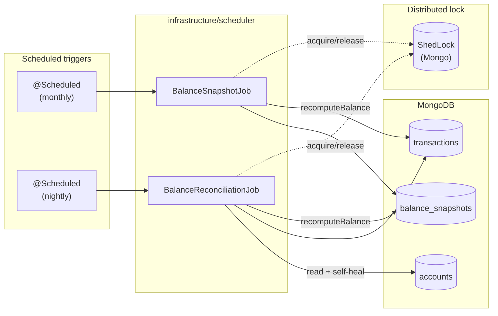
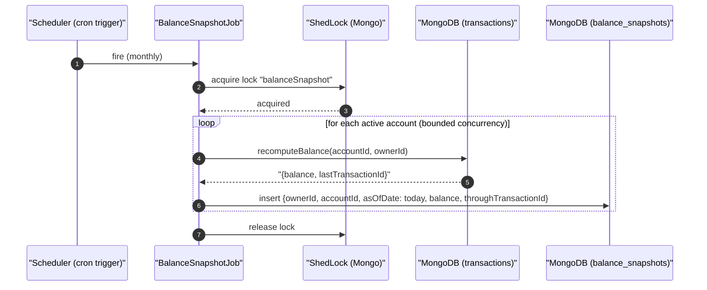
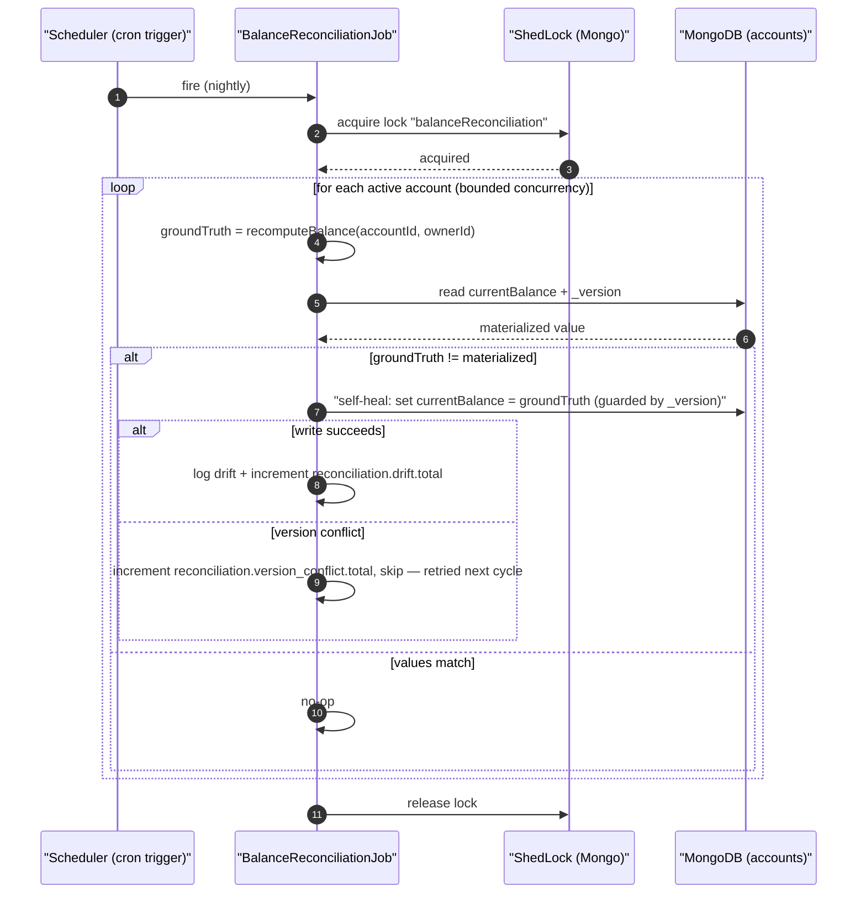

# Technical Specification: Account Balance Snapshotting & Reconciliation

> **Document metadata**
> - **ID:** SPEC-003-RECON
> - **Status:** Approved
> - **Author:** Architect
> - **Last updated:** 2026-08-02
> - **Linked PRD:** `docs/prd/PRD-CROSS-01-materialized-balance-projections.md` — PRD-CROSS-01
>   (FR-005, NFR-004, NFR-006)
> - **Linked ADR:** `docs/adr/ADR-003-materialized-derived-balances.md`
> - **Source design:** `docs/technical-solutions/materialized-projections.md` (SPEC-CROSS-01) §3.3–§3.4 —
>   that document designed `BalanceSnapshotJob`/`BalanceReconciliationJob` as a cross-cutting
>   pattern (shared with `005-cards`'s future invoice-total equivalent) but explicitly left them
>   unbuilt ("designed, not built this delivery"). This document turns that design into concrete,
>   account-scoped implementation guidance — the same role `specs/003-accounts/implementation-notes.md`
>   §11 already played for the change-stream/projector half.
> - **Sibling doc:** `specs/003-accounts/implementation-notes.md` §11.10 tracks this as explicitly
>   deferred; once this spec is implemented, that section's checklist should flip to done.
> - **Reviewers:** Lucas

---

## 1. Overview

`AccountBalanceProjector` (built, `specs/003-accounts/implementation-notes.md` §11.6) keeps
`accounts.currentBalance` in sync with every `transactions` write via change-stream → SQS →
idempotent `$inc`. That closes FR-002/FR-003 (PRD-CROSS-01) but leaves FR-005 open: nothing
detects or corrects drift if the projector ever applies an event wrong (a logic bug, not a crash —
crashes are already covered by the transactional wrap in §11.6). This spec closes that gap with
two scheduled components:

- **`BalanceSnapshotJob`** — periodically checkpoints each account's ground-truth balance
  into `balance_snapshots`, bounding how far back any future recomputation has to scan.
- **`BalanceReconciliationJob`** — periodically recomputes ground truth from the latest snapshot
  forward, compares it to the materialized `currentBalance`, and self-heals on mismatch.

Both are scoped to accounts only in this pass — `005-cards` has no invoice data yet, so its
`InvoiceTotalSnapshotScheduler`/`InvoiceTotalReconciliationJob` equivalents are out of scope here
and will reuse this same shape once that feature exists (SPEC-CROSS-01 §3.5).

**A dependency this spec reintroduces:** the ground-truth aggregation (`$match` + `$group` +
`$sum` over `transactions`) was fully deleted from `AccountRepositoryAdapter` during the read-path
rewire (implementation-notes.md §11.7), since nothing on the request path calls it anymore.
`specs/003-accounts/data-model.md` already documents it under its permanent name,
**`recomputeBalance`**, scoped by the latest snapshot rather than full history — this spec is what
actually re-adds it, now exclusively for use by the two components below (never the request path).

**Architecture diagram:**



---

## 2. Architecture

### 2.1 Key Architectural Decisions

- **Adopt ShedLock now, rather than reusing `ProjectionLeaderElector`.** `ProjectionLeaderElector`
  (built for the change-stream listener, §3.1a of SPEC-CROSS-01) is a `Flux`-based continuous
  lease that a long-running subscriber holds indefinitely. `@Scheduled` jobs are point-in-time
  ticks, not continuous subscribers — forcing them onto the `Flux` leadership-signal shape would
  be a worse fit than the lock ADR-002 already earmarked for exactly this (`@Scheduled` +
  distributed lock). Since `005-cards`/`InvoiceRolloverScheduler` hasn't been built yet, **this is
  the first feature to actually add the ShedLock dependency** — the same "first mover stands up
  shared infra" situation `implementation-notes.md` §11.3 already documented for SQS. Concretely:
  `net.javacrumbs.shedlock:shedlock-spring` + `shedlock-provider-mongo-reactivestreams` (the
  reactive variant, matching `ReactiveMongoTemplate` — not the blocking `shedlock-provider-mongo`).
- **Snapshot cadence: monthly**, matching ADR-003's assumption (open question, not load-tested —
  see SPEC-CROSS-01 Appendix Q3). Cheap to change later since nothing else depends on the exact
  cadence, only on "some snapshot exists before the reconciliation job needs one."
- **`recomputeBalance` is scoped by the latest snapshot, not full history.** `initialBalance +
  SUM(transactions since epoch)` gets more expensive forever as an account accumulates history
  (NFR-006 — the design must not assume small, fixed history). Scoping to "latest
  `balance_snapshots` entry + transactions since `lastTransactionId`" keeps the scan bounded
  regardless of account age.
- **Self-heal is `_version`-guarded, not a blind overwrite.** A reconciliation self-heal racing a
  live projector `$inc` must not clobber it. See §3.4 flow and §6.2.

### 2.2 Design Patterns Used

| Pattern | Applied where | Rationale |
|---|---|---|
| Scheduled job + distributed lock | `BalanceSnapshotJob`, `BalanceReconciliationJob` | Exactly one instance runs per cycle in a horizontally-scaled deployment — same shape as `InvoiceRolloverScheduler` (ADR-002) |
| Snapshot / checkpoint | `balance_snapshots` | Bounds recomputation cost as history grows (NFR-006) |
| Self-healing reconciliation | `BalanceReconciliationJob` | Converts "the balance is wrong" from a support ticket into an automatic correction + alertable metric (FR-005) |
| Optimistic concurrency guard | `_version` on `AccountDocument` | Prevents a self-heal write from clobbering a concurrent, legitimate projector `$inc` |

---

## 3. Component / Service Breakdown

### 3.1 `recomputeBalance` (reintroduced port method)

**Responsibility:** Ground-truth balance for an account, scoped by the latest snapshot rather than
full history.

**Exposes (domain port, `AccountReadRepository`):**
```java
Mono<Long> recomputeBalance(String accountId, String ownerId);
```

**Depends on:** `balance_snapshots` (latest entry for the account, if any — absent means "no
snapshot yet, sum full history this one time"), `transactions` (signed-amount sum since the
snapshot's `lastTransactionId`, or since the beginning if no snapshot exists).

**Implementation shape** (`AccountRepositoryAdapter`, mirrors the deleted §5 aggregation, now
scoped):
```java
Mono<Long> recomputeBalance(String accountId, String ownerId) {
  return findLatestSnapshot(accountId, ownerId)
      .flatMap(snapshot -> sumSince(accountId, ownerId, snapshot.throughTransactionId())
          .map(delta -> snapshot.balance() + delta))
      .switchIfEmpty(sumAll(accountId, ownerId)); // no snapshot yet — full-history fallback
}
```

Only two callers, ever: `BalanceSnapshotJob` and `BalanceReconciliationJob`. Never the
request path (that invariant is exactly what §11.7's read-path rewire established).

### 3.2 `BalanceSnapshotJob`

**Responsibility:** Once per cycle (monthly), write one `balance_snapshots` document per account,
checkpointing `recomputeBalance`'s result and the last transaction it included.

**Exposes:** a single `@Scheduled` method, no public API, ShedLock-guarded (`@SchedulerLock(name =
"balanceSnapshot")`).

**Depends on:** `AccountReadRepository.recomputeBalance`, `AccountRepository` (list all active
accounts), `BalanceSnapshotRepository` (new write port, insert-only).

**Flow:**


### 3.3 `BalanceReconciliationJob`

**Responsibility:** Catch drift between `accounts.currentBalance` (materialized) and ground truth;
self-heal.

**Exposes:** a single `@Scheduled` method (nightly), ShedLock-guarded (`@SchedulerLock(name =
"balanceReconciliation")`).

**Depends on:** `AccountReadRepository.recomputeBalance`, `AccountRepository` (read current
balance, write self-heal, `_version`-guarded).

**Flow:**


### 3.4 Package placement (hexagonal architecture)

| Component | Package | Rationale |
|---|---|---|
| `BalanceSnapshotJob`, `BalanceReconciliationJob` | `infrastructure/scheduler` | Timer-driven inbound triggers, not HTTP-facing — new package for this codebase, first occupant (mirrors where `InvoiceRolloverScheduler` will later live) |
| `AccountReadRepository.recomputeBalance` | `domain/port` (interface) + `infrastructure/adapter/persistence` (impl in `AccountRepositoryAdapter`) | Same port/adapter split every other read method in this class already uses |
| `BalanceSnapshotRepository` (new write port) | `domain/port` (interface) + `infrastructure/adapter/persistence` (impl) | Insert-only write port for `balance_snapshots`, same `*Repository` shape as `AccountRepository` |
| ShedLock configuration (`LockProvider` bean) | `infrastructure/config` | Framework wiring, not a port implementation — same tier as `MongoIndexConfig`/`MongoTransactionConfig` |

---

## 4. Data Model

No new fields or collections — `balance_snapshots` is already fully specified in
`specs/003-accounts/data-model.md` (`ownerId`, `accountId`, `asOfDate`, `balance`,
`lastTransactionId`) and `MongoIndexConfig` already indexes it (`{ownerId, accountId,
asOfDate desc}`, per implementation-notes.md §11.11). This spec adds exactly one new collection:

| Addition | Description |
|---|---|
| `shedLock` collection | ShedLock's own Mongo lock-storage schema (job name, lock-until timestamp). Infra-only — no `ownerId`, not user data, same reasoning `projection_checkpoints`/`projection_leases` are excluded from the tenant data model. |

---

## 5. API Contracts

None. Both components are internal scheduled jobs with no HTTP surface — _N/A_.

---

## 6. Cross-Cutting Concerns

### 6.1 Consistency

The reconciliation job is a backstop for logic bugs, not a substitute for the projector's own
transactional guarantee (§11.6) — in steady state it should find zero drift, every cycle.

### 6.2 Error Handling

- A self-heal write racing a concurrent, legitimate projector `$inc` fails its `_version` check;
  the job logs a version-conflict metric and moves on — the next cycle re-evaluates, so a
  transient race never needs special-case retry logic within the same run.
- A failure partway through the account loop (e.g. one account's recompute throws) must not abort
  the whole cycle — catch per-account, log, continue; a stuck job that never completes is worse
  than one bad account waiting until the next cycle.
- ShedLock's own failure mode (lock table unreachable) simply means the job doesn't run this
  cycle — safe by construction, since both jobs are idempotent and re-run cleanly next cycle.

### 6.3 Observability

Reuses the metric names SPEC-CROSS-01 §6.3 already defined for this exact purpose (not
re-inventing new names):

| Signal | Name | When |
|---|---|---|
| Counter | `reconciliation.drift.total` | Every self-heal correction — should be ~0 in steady state; nonzero signals a projector bug |
| Counter | `reconciliation.version_conflict.total` | Self-heal writes that lost a race to `_version` (expected occasionally, concerning if frequent) |
| Gauge | `invoice.rollover.lock.holder`-equivalent: `balance.scheduler.lock.holder` | Whether this instance currently holds either ShedLock, per job (debugging multi-instance behavior) |

`reconciliation.drift.total` is the single most important signal this spec produces — see
Appendix Q1 below on whether it should page or just log.

### 6.4 Security Considerations

No new public surface (§5). `balance_snapshots` and `shedLock` are read/written exclusively by
infrastructure-layer background processes, never exposed through a controller. Every snapshot and
recompute is scoped by `ownerId`, preserving tenancy (P2) the same way the projector already does.

### 6.5 Rollout & Feature Flags

No flag — straightforward sequential rollout, since `003-accounts` already has live data flowing
through the projector:

1. Add the ShedLock dependency + `LockProvider` bean (`infrastructure/config`) — no behavior
   change, nothing schedules anything yet.
2. Reintroduce `recomputeBalance` on `AccountReadRepository`/`AccountRepositoryAdapter`, scoped by
   latest snapshot with a full-history fallback when none exists.
3. Deploy `BalanceSnapshotJob`. First run has no prior snapshot for any account, so it falls
   back to full history once per account — acceptable, a one-time cost, same shape as the original
   backfill (§11.5).
4. Deploy `BalanceReconciliationJob`. Watch `reconciliation.drift.total` for a full cycle before
   trusting it as the safety net — it should read ~0 given the projector has been live and
   transactional since §11.6.

---

## 7. Requirements Traceability

| Requirement ID | Description (abbreviated) | Status | Notes / Where addressed |
|---|---|---|---|
| FR-005 | Auto-detect and self-heal balance drift | ✅ Satisfied | §3.3 `BalanceReconciliationJob` |
| NFR-004 | Every balance change traceable to its cause | ✅ Satisfied | §6.2 — self-heal is logged + metric'd, never silent; underlying transaction history untouched |
| NFR-006 | No assumption of small, fixed history | ✅ Satisfied | §2.1, §3.1 — `recomputeBalance` bounded by snapshot, not full history |

> **Status legend:** ✅ Satisfied · ⚠️ Partial / deferred · ❌ Not satisfied (requires discussion)

---

## Appendix: Open Questions

| # | Question | Owner | Status |
|---|---|---|---|
| 1 | Should `reconciliation.drift.total` going nonzero page someone, or is a metric + log line enough for a single-user app? | Architect | Open — carried over from SPEC-CROSS-01 Appendix Q1; no alerting infra exists yet in this project. |
| 2 | Snapshot cadence — monthly, or every N transactions, or both (whichever comes first)? | Architect | Open — carried over from SPEC-CROSS-01 Appendix Q3; monthly assumed here, not load-tested against any real cadence need. |
| 3 | Bounded concurrency for the per-account loop in both jobs — what's a sane default (e.g. `flatMap(..., concurrency)`) before this needs revisiting for a large account count? | Architect | Open — not a concern at current data volume, worth a number once account count is non-trivial. |
