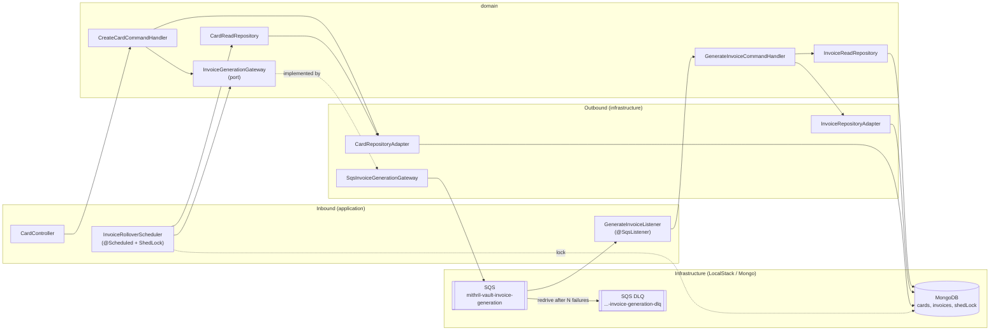
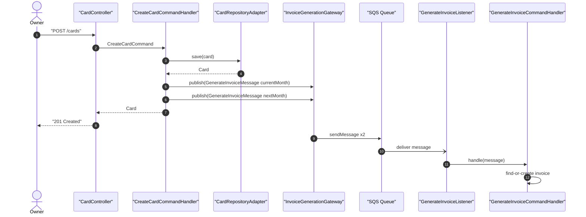
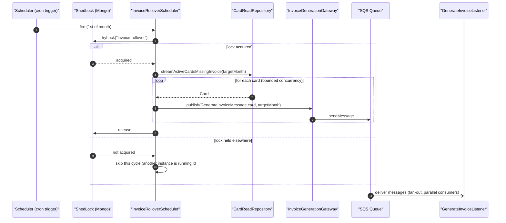
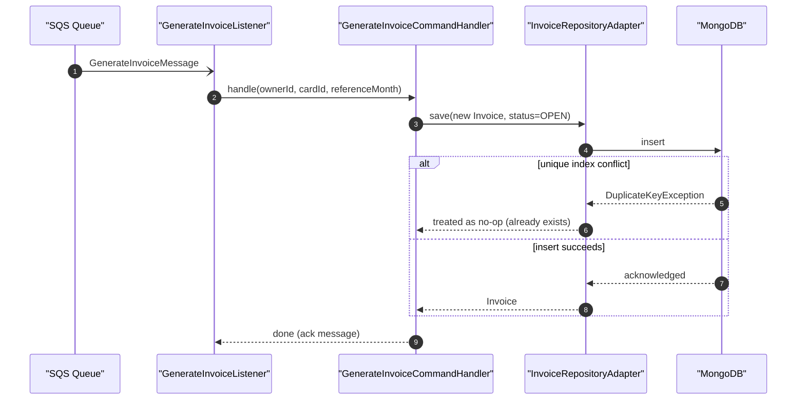
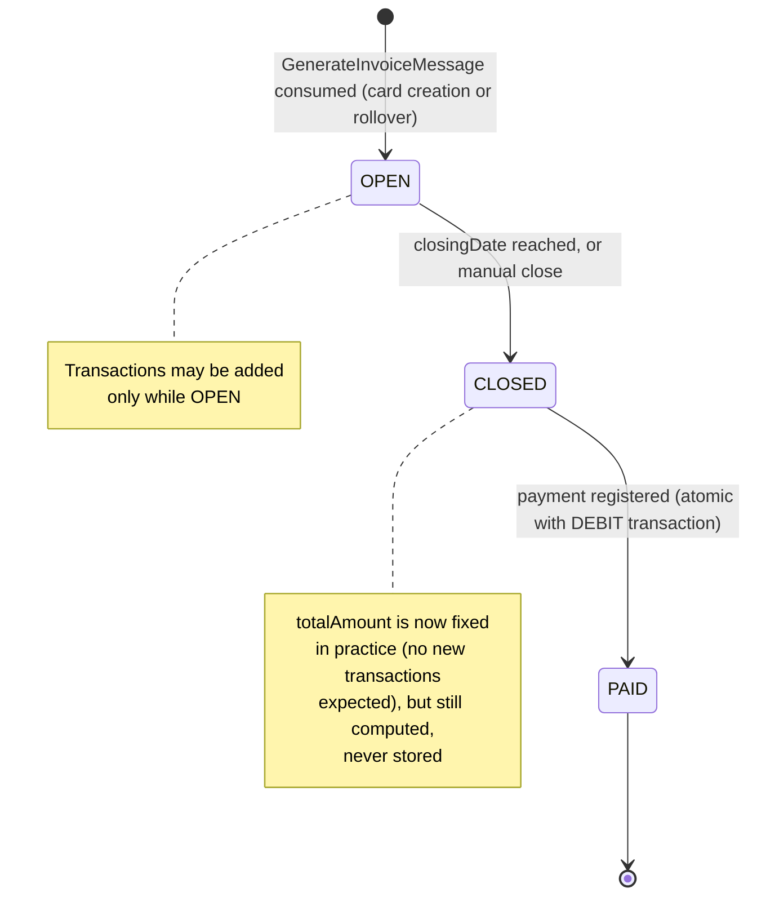

# Technical Specification: Cards & Invoices

> **Document metadata**
> - **ID:** SPEC-005
> - **Status:** Approved
> - **Author:** Architect
> - **Last updated:** 2026-07-26
> - **Linked PRD:** PRD-005 — Cards & Invoices
> - **Reviewers:** Lucas

---

## 1. Overview

This spec covers the `Card`/`Invoice` domain (registration, lifecycle, payment) and — the part
built deliberately over-scoped as a learning exercise — invoice generation as a decoupled,
queue-driven process rather than a synchronous call. The everyday CRUD (card registration,
invoice close/pay, listing) follows the exact same hexagonal shape as `003-accounts` and
`004-transactions`; this document gives that part a light pass and spends its depth on the new
ground: how an invoice comes to exist in the first place, at two triggers (card creation, monthly
rollover), without a synchronous call blocking either one, and without breaking if the card count
were in the millions instead of a handful.

The key architectural decision — event-driven generation via SQS, with the monthly job acting as
a self-healing reconciler rather than a one-shot batch — is recorded in
`docs/adr/ADR-002-invoice-generation-via-sqs.md`; this document describes the resulting shape.

**Architecture diagram:**



---

## 2. Architecture

### 2.1 Key Architectural Decisions

- **Event-driven invoice generation via SQS** — decouples both triggers (card creation, monthly
  rollover) from the write itself, and makes the monthly job fan out instead of loop. See
  ADR-002.
- **Monthly job is a reconciler, not a batch processor** — it always re-derives "cards missing an
  invoice for the target month" from the database rather than tracking what it previously
  published; this is what makes a lost message self-healing instead of a permanent gap. See
  ADR-002 "Reconciliation as the resilience mechanism."
- **Derived values computed on read, never stored** — `invoice.totalAmount`,
  `creditCard.utilizedAmount`, `creditCard.availableLimit` are Mongo aggregation pipelines behind
  `InvoiceReadRepository`/`CardReadRepository`, per `docs/architecture-contract.md` P4. Already
  decided prior to this spec; restated here because it's the answer to "how is available limit
  computed" — no caching, no invalidation logic, no scheduled recompute job.
- **Idempotency via the existing unique index, not a separate dedup table** — the
  `{ownerId, creditCardId, referenceMonth}` unique index (already in `data-model.md`) is the sole
  idempotency mechanism for the SQS consumer, same pattern 004-transactions uses for
  `importHash`/`fitid`.

### 2.2 Design Patterns Used

| Pattern | Applied where | Rationale |
|---|---|---|
| Ports & Adapters (hexagonal) | `InvoiceGenerationGateway` (domain port) / `SqsInvoiceGenerationGateway` (infra adapter) | Domain publishes a message without knowing it's SQS; swappable for the Mongo-outbox alternative in ADR-002 without touching domain code |
| Reconciliation job | `InvoiceRolloverScheduler` | Re-derives desired state every cycle instead of trusting a log of past actions — tolerant of lost messages by construction |
| Distributed lock (leader election) | `InvoiceRolloverScheduler` + ShedLock | Prevents every horizontally-scaled instance from firing the same `@Scheduled` method concurrently |
| Idempotent consumer | `GenerateInvoiceListener` → `GenerateInvoiceCommandHandler` | At-least-once SQS delivery is safe because a duplicate hits the unique index and is treated as a no-op |
| Dead-letter queue | SQS redrive policy | Bounds retry attempts per message; failures become an observable queue instead of a silent drop or an infinite retry loop |

---

## 3. Component / Service Breakdown

### 3.1 `CreateCardCommandHandler`

**Responsibility:** Validate and persist a new card; kick off invoice bootstrap without waiting
on it.

**Exposes:** `handle(CreateCardCommand, ownerId): Mono<Card>`

**Depends on:** `CardRepository` (write), `InvoiceGenerationGateway` (publish).

**Card creation flow:**



Note the response returns after step 6 (before the queue delivers) — invoice creation completes
asynchronously. See ADR-002 "Negative consequences" for the resulting eventual-consistency window
and its interaction with `TransactionOriginResolver`.

### 3.2 `InvoiceRolloverScheduler`

**Responsibility:** Once a month, ensure every active card has an invoice for the upcoming
reference month, without loading the full card set into memory and without racing against other
instances.

**Exposes:** a single `@Scheduled(cron = "...")` method, no public API (it is an inbound trigger,
like a controller, just timer-driven).

**Depends on:** `CardReadRepository` (read), `InvoiceGenerationGateway` (publish), ShedLock (via
its Spring Boot integration annotation on the scheduled method).

**Monthly rollover flow:**



The `streamActiveCardsMissingInvoice` read is a `Flux`, consumed with a bounded `flatMap`
concurrency on the publish side — never `collectList()` — so memory use does not grow with card
count (NFR-006).

### 3.3 `GenerateInvoiceListener` / `GenerateInvoiceCommandHandler`

**Responsibility:** Given `(ownerId, cardId, referenceMonth)`, ensure exactly one invoice exists
for that card/month; treat "already exists" as success, not an error.

**Exposes:** `@SqsListener` method binding `GenerateInvoiceMessage` → handler call.

**Depends on:** `InvoiceReadRepository` (existence check, optional — the unique index is the real
guard), `InvoiceRepository` (write).

**Generation flow (single message, either trigger):**



### 3.4 `InvoiceGenerationGateway` (domain port) / `SqsInvoiceGenerationGateway` (infra adapter)

**Responsibility:** Publish a `GenerateInvoiceMessage`; domain code has no knowledge that SQS (or
LocalStack) is involved.

**Exposes:** `publish(GenerateInvoiceMessage message): Mono<Void>`

**Depends on (infra side only):** Spring Cloud AWS SQS template, configured against the
LocalStack endpoint the same way `spring-cloud-aws-secrets` already is
(`api/src/main/resources/application-local.yaml`).

---

## 4. Data Model

Field-level schema for `credit_cards` and `invoices` is unchanged from
`specs/005-cards/data-model.md` — this section only adds what this spec introduces: the queue
message shape and the invoice lifecycle as a proper state diagram (superseding the ASCII sketch
previously in `data-model.md`).

### 4.1 Queue Message

Not a persisted entity — documented here because it crosses a component boundary the same way an
API contract does.

**`GenerateInvoiceMessage`** (JSON body on `mithril-vault-invoice-generation`):

```json
{
  "ownerId": "uuid",
  "creditCardId": "uuid",
  "referenceMonth": "2026-07"
}
```

| Field | Type | Notes |
|---|---|---|
| `ownerId` | string (UUID) | Tenant scope — carried through so the consumer never needs a lookup to determine ownership |
| `creditCardId` | string (UUID) | FK → `credit_cards` |
| `referenceMonth` | string | `YYYY-MM`, same format as `invoices.referenceMonth` |

### 4.2 State Diagram — Invoice Lifecycle



### 4.3 Migrations

No relational migrations (MongoDB, schema-first per `data-model.md`). New index/collection
additions introduced by this spec:

| Addition | Description |
|---|---|
| `shedLock` collection | ShedLock's own Mongo lock-storage schema (job name, lock-until timestamp). Infra-only — no `ownerId`, not user data. |
| `mithril-vault-invoice-generation` SQS queue + `-dlq` | Provisioned via `localstack/init/02-seed-sqs.sh`, mirroring `01-seed-secrets.sh`'s style; DLQ attached via redrive policy. |

---

## 5. API Contracts

No changes to `specs/005-cards/contracts/card.openapi.yaml` — the queue is purely internal;
`POST /cards` keeps its existing 201 response shape (`CreditCardResponse`), it simply no longer
waits on invoice creation before returning. See `card.openapi.yaml` for the full REST contract
(already written, unaffected by this spec).

---

## 6. Cross-Cutting Concerns

### 6.1 Authentication & Authorisation

Unchanged — `@CurrentOwnerId` on `CardController`/future `InvoiceController` endpoints, same as
`004-transactions`. The SQS message carries `ownerId` explicitly (§4.1) so the consumer never
needs to re-derive tenancy from a security context that doesn't exist in a queue-triggered flow.

### 6.2 Error Handling

- `GenerateInvoiceListener` catches `DuplicateKeyException` from the write and acknowledges the
  message (success) rather than propagating it — a duplicate is expected, not an error (ADR-002).
- Any other exception during consumption leaves the message unacked; SQS's visibility timeout
  makes it available for redelivery, up to the redrive policy's max-receive-count, after which it
  moves to the DLQ.

### 6.3 Observability

| Signal | Name | When |
|---|---|---|
| Counter | `invoice.generation.requested.total` | Every `GenerateInvoiceMessage` published (tagged by trigger: `card_creation` / `monthly_rollover`) |
| Counter | `invoice.generation.created.total` / `.duplicate.total` | Every consumer outcome |
| Counter | `invoice.generation.dlq.total` | Messages that exhausted retries |
| Gauge | `invoice.rollover.lock.holder` | Whether this instance currently holds the ShedLock (debugging multi-instance behavior) |

### 6.4 Security Considerations

The queue is internal infrastructure, not a public surface — no additional authn/authz surface is
introduced. `ownerId` in the message is trusted because it originates server-side (from the
already-authenticated card-creation request or from the scheduler's own read of owned cards),
never from an external caller, preserving P2 (tenancy) the same way every other write path does.

### 6.5 Rollout & Feature Flags

No flag — this is new functionality with no prior behavior to preserve. Rollout order:
provision LocalStack SQS + ShedLock collection → deploy consumer/scheduler → deploy
`CreateCardCommandHandler` change last (so the consumer exists before anything publishes to it).

---

## 7. Requirements Traceability

| Requirement ID | Description (abbreviated) | Status | Notes / Where addressed |
|---|---|---|---|
| FR-001 | Register a credit card | ✅ Satisfied | §3.1, existing `card.openapi.yaml` |
| FR-002 | Auto-create current+next invoice on card creation | ✅ Satisfied | §3.1 sequence diagram |
| FR-003 | Monthly auto-create for all active cards | ✅ Satisfied | §3.2 sequence diagram |
| FR-004 | Never duplicate an invoice for card+month | ✅ Satisfied | §3.3 — unique index + `DuplicateKeyException` no-op |
| FR-005 | Resolve transaction date → correct invoice | ⚠️ Deferred | Already implemented in `TransactionOriginResolver` (004); this spec only affects invoice *existence*, not resolution logic |
| FR-006 | Derived `totalAmount`/`utilizedAmount`/`availableLimit` | ✅ Satisfied | §2.1 — restates the pre-existing P4 decision, no new work |
| FR-007 | Close an OPEN invoice | ⚠️ Deferred | Unchanged from `card.openapi.yaml` `POST /invoices/{id}/close`; not touched by this spec |
| FR-008 | Atomic pay (CLOSED → PAID + DEBIT txn) | ⚠️ Deferred | Unchanged from `card.openapi.yaml` `POST /invoices/{id}/pay`; not touched by this spec |
| FR-009 | Update/deactivate a card | ⚠️ Deferred | Standard CRUD, same shape as `003-accounts`, not elaborated here |
| FR-010 | List invoices / invoice detail | ⚠️ Deferred | Standard read endpoints, already in `card.openapi.yaml` |
| NFR-001 | Integer centavos | ✅ Satisfied | Inherited from root money contract; no float anywhere in §3–4 |
| NFR-002 | Atomic invoice payment | ⚠️ Deferred | Same `TransactionalOperator` pattern as 004's transfer handler; not elaborated here |
| NFR-003/004 | Tenancy / 404 not 403 | ✅ Satisfied | §6.1 |
| NFR-005 | Optimistic locking | ✅ Satisfied | `@Version` on `CreditCardDocument`/`InvoiceDocument`, per `data-model.md` |
| NFR-006 | No full-memory load, no single-failure block | ✅ Satisfied | §3.2 — streamed `Flux`, bounded concurrency, per-card independent messages |
| NFR-007 | Self-healing within one cycle | ✅ Satisfied | ADR-002 "Reconciliation as the resilience mechanism" |
| NFR-008 | Idempotent generation | ✅ Satisfied | §3.3, §3.4 |

> **Status legend:** ✅ Satisfied · ⚠️ Partial / deferred · ❌ Not satisfied (requires discussion)

---

## Appendix: Open Questions

| # | Question | Owner | Status |
|---|---|---|---|
| 1 | Should `TransactionOriginResolver.findOpenInvoice` gain a short synchronous retry/backoff to ride out the eventual-consistency window from §3.1, or is a 404-and-retry-client-side acceptable? | Architect | Open — flagged in ADR-002 "Risks and mitigations"; needs a decision when 004's TODO is closed. |
| 2 | Should invoice auto-close on `closingDate` reuse `InvoiceRolloverScheduler`'s ShedLock-guarded scheduling shape (PRD-005 Open Question 1)? | Architect | Open. |
